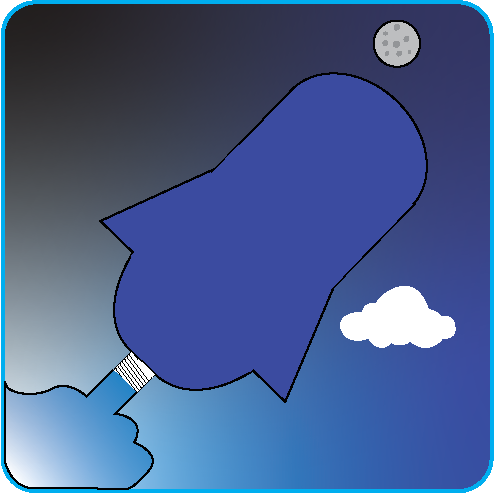

<br/>
<p align="center">
  <a href="https://github.com/Yaurrdautia/arduino_eng2_rockets">
    
  </a>

  <h3 align="center">Arduino Bottle Rockets</h3>

  <p align="center">
    Arduino rockets with sensors. 
    <br/>
    <br/>
    <a href="https://github.com/Yaurrdautia/arduino_eng2_rockets/issues">Report Bug</a>
    .
    <a href="https://github.com/Yaurrdautia/arduino_eng2_rockets/issues">Request Feature</a>
  </p>
</p>

## Table Of Contents

* [About the Project](#about-the-project)
* [Built With](#built-with)
* [Getting Started](#getting-started)
  * [Prerequisites](#prerequisites)
  * [Installation](#installation)
* [Usage](#usage)
* [Roadmap](#roadmap)
* [Contributing](#contributing)
* [License](#license)
* [Authors](#authors)
* [Acknowledgements](#acknowledgements)

## About The Project

This is a project for building rockets. I thought why not upload the code if I'm writing the code anyways. This repository is for tracking changes to the code, share code, and help some people who may need a little bit of help with coding their rocket. Read getting started to learn more.

## Built With

This project was built using the Arduino IDE. It uses a few libraries. See getting started. 

## Getting Started

This is an example of how you may give instructions on setting up your project locally.
To get a local copy up and running follow these simple example steps.

### Prerequisites

Go to the Arduino website and get their ide. (https://www.arduino.cc/en/software)

### Installation

1. Clone the repo

```sh
git clone https://github.com/Yaurrdautia/arduino_eng2_rockets.git
```
2. Open the folder you cloned the project into. 

3. Go into the main folder and open both controler_code.ino and rocket_side_code.ino

4. Set the pins in the rocket_side_code.ino file.

5. Get libraries:
     a. You need the libraries SFE_BMP, MQ135, MPU6050 (and SD,Servo but you already have those)
     b. Links: 
          [SFE_BMP](https://github.com/LowPowerLab/SFE_BMP180)
          [MPU6050](https://github.com/ElectronicCats/mpu6050)
          [MQ_135](https://github.com/Phoenix1747/MQ135)
6. Add the libraries to the libraries folder. Usually it's in Documents/Arduino/libraries
7. Upload both files to Arduino, wire all sensors up.


## Usage

Used to log some simple data using Arduino Uno and a rocket made with two liter bottles

## Roadmap

See the [open issues](https://github.com/Yaurrdautia/arduino_eng2_rockets/issues) for a list of proposed features (and known issues).

## Contributing

Contributions are what make the open source community such an amazing place to be learn, inspire, and create. Any contributions you make are **greatly appreciated**.
* If you have suggestions for adding or removing projects, feel free to [open an issue](https://github.com/Yaurrdautia/arduino_eng2_rockets/issues/new) to discuss it, or directly create a pull request after you edit the *README.md* file with necessary changes.
* Please make sure you check your spelling and grammar.
* Create individual PR for each suggestion.
* Please also read through the [Code Of Conduct](https://github.com/ShaanCoding/ReadME-Generator/blob/main/CODE_OF_CONDUCT.md) before posting your first idea as well.

### Creating A Pull Request

1. Fork the Project
2. Create your Feature Branch (`git checkout -b feature/AmazingFeature`)
3. Commit your Changes (`git commit -m 'Add some AmazingFeature'`)
4. Push to the Branch (`git push origin feature/AmazingFeature`)
5. Open a Pull Request

## License

Distributed under the MIT License. See [LICENSE](https://github.com/Yaurrdautia/arduino_eng2_rockets/blob/main/LICENSE) for more information.

## Authors

* **Yaurrdautia** - *Student at Tesla STEM* - [Yaurrdautia](https://github.com/Yaurrdautia) - *Main code dev for project*

